# EAIDK-310开发记录
本文档主要介绍如何给EAIDK-310开发板更换系统，包括如何[获取并配置rootfs](#获取并配置rootfs)（根文件系统），[烧录镜像](#烧录镜像)，[远程连接开发板](#远程连接开发板)，[开发环境配置](#开发环境配置)，[任务实现](#任务实现)，[附录](#附录)。
## 说明
本次开发使用的pc主机平台为windows与Arch Linux进行，开发板烧录系统为ubuntu，对于Linux初学者不建议在pc直接安装实体机，推荐安装虚拟机进行rootfs配置，Arch Linux与ubuntu的部分指令不同，灵活修改即可。

例如在Arch Linux安装fish
```shell
sudo pacman -Sy fish
```
在ubuntu应改为
```shell
sudo apt install fish
```
## 获取并配置rootfs
rootfs（root filesystem）指的是根文件系统，它是 Linux 系统启动后挂载的第一个文件系统，负责提供操作系统运行所需的最基本环境。EAIDK-310的默认系统为Fedora28，由于系统老旧并且没有被并入主线内核，因此更方便的方法是，使用官方自带的Linux4.4内核为基础，通过替换`rootfs.img`的方式来刷入自定义的系统，运行ubuntu22.04等比较新的发行版。

参考CSDN的一篇[博客](https://blog.csdn.net/Elko_265/article/details/131316611)，可以直接去SD card images网站下载ubuntu的rootfs而不需要手动构建，网站[链接](https://sd-card-images.johang.se/boards/leez_p710.html)，在Downloads for Leez P720栏目下选择 `ubuntu-jammy-arm64-xxxxxx.bin.gz`下载rootfs，文件名的xxxxxx是默认root密码，ubuntu-jammy就是ubuntu22.04，arm64代表系统架构。

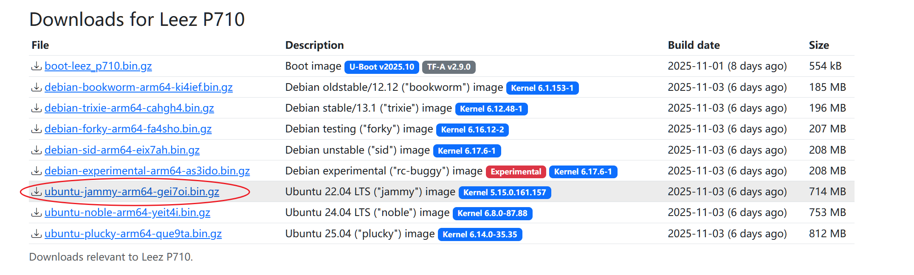

使用上述网站制作的`rootfs.img`是无法驱动起无线和蓝牙的，通过EAIDK官方提供的`rootfs.img`镜像中可以看出有一个`/system`文件夹，而这就是无线和蓝牙的驱动目录，将其复制到自己制作的`rootfs.img`镜像中即可。

解压下载的官方Image，将下载的ubuntu镜像移动至解压出的Image目录中，后续操作均在该目录下进行
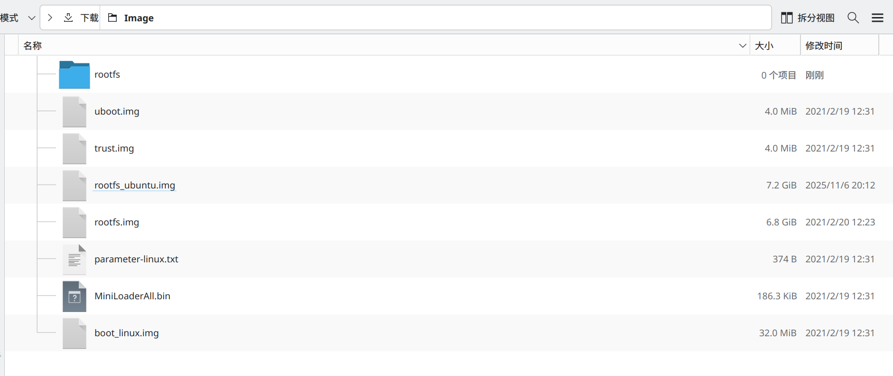

使用zcat解压下载的rootfs，重定向输出到映像文件，注意修改为下载的rootfs名称
```shell
zcat ubuntu-jammy-arm64-xxxxxx.bin.gz > rootfs_ubuntu.img
```

扩大映像文件到7400MB

```shell
dd if=/dev/zero bs=1M count=0 seek=7400 of=rootfs_ubuntu.img
```
新建一个目录，用于挂载rootfs
```shell
mkdir rootfs
```
wifi驱动和蓝牙驱动在旧rootfs的`/system`目录下，需要挂载镜像把`/system`复制出来，旧rootfs指的是官方提供的fedora28的rootfs

```shell
sudo mount -o loop rootfs.img rootfs
sudo cp -r rootfs/system .
sudo umount rootfs
```

挂载新rootfs到这个目录，注意这里的rootfs是新的ubuntu22.04的rootfs，然后把system复制到新rootfs

```shell
sudo mount -o loop rootfs_ubuntu.img rootfs
sudo cp -r system rootfs/
```
即使映像文件扩大到7400MB，rootfs的分区大小仍然是原来的大小，使用resize2fs命令扩大分区

```shell
sudo resize2fs /dev/loop0
```
因为本机的架构为x86_64，rootfs的架构为arm64，需要安装binfmt支持跨架构运行，其他Linux发行版自行替换下面的命令

```shell
sudo pacman -Sy qemu-user-static-binfmt
```
安装arch-install-scripts，其提供的的arch-chroot命令比chroot更方便，可以自动挂载/proc、/sys、/dev等目录

```shell
sudo pacman -Sy arch-install-scripts
```
使用arch-chroot进入该镜像

```shell
sudo arch-chroot rootfs
```

如果未发生任何错误，应该能看到提示符`root@主机名:/#`，说明镜像完好

设置PATH变量

```shell
export PATH=/usr/sbin:/usr/bin:/sbin:/bin
```
换apt源

```shell
sed -i 's/deb.debian.org/mirrors.ustc.edu.cn/g' /etc/apt/sources.list
sed -i 's/security.debian.org/mirrors.ustc.edu.cn/g' /etc/apt/sources.list
```
安装本地化支持
```shell
apt update
apt install -y dialog locales
dpkg-reconfigure locales
```
此时会弹出对话框，一直按方向下找到`zh_CN.UTF-8 UTF-8`，按空格选中，回车，再选中`zh_CN.UTF-8`，回车，等待生成配置结束，可以输入`apt`观察输出确认本地化是否成功

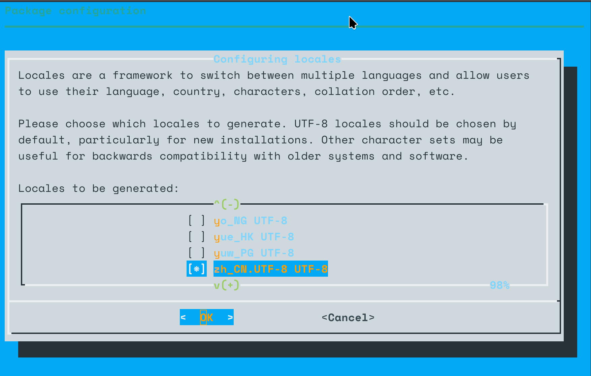

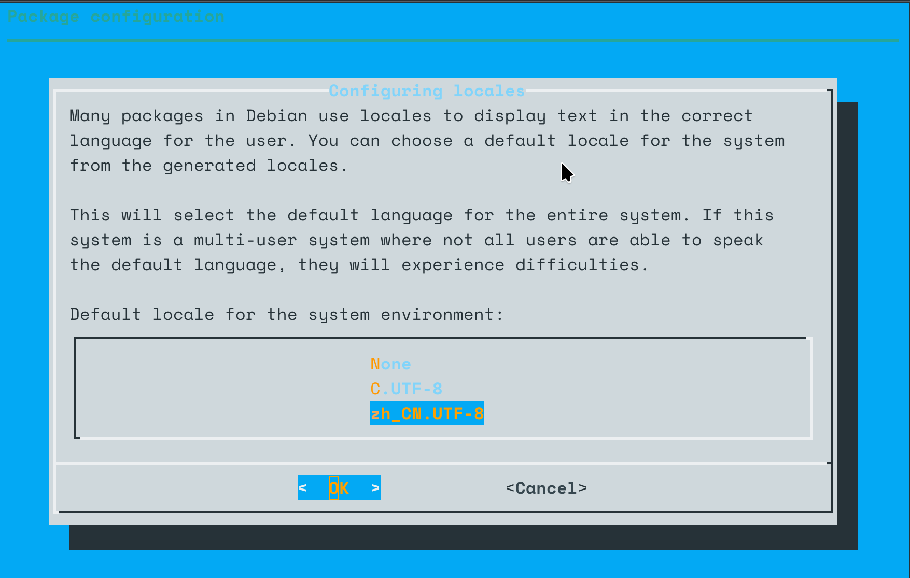


安装常用系统组件，本次安装时，python的版本为3.11，gcc的版本为12，cmake的版本为3.25

```shell
apt install -y sudo python3 vim apt-utils wget curl net-tools iputils-ping ca-certificates rsync file binutils build-essential cmake git pkg-config
```

新建一个普通用户，默认shell为bash，加入到sudo组里，username替换成用户名

```shell
useradd -m -s /bin/bash -G sudo username
```

设置这个用户的密码，根据提示输入密码，注意输入的密码不会显示在屏幕上

```shell
passwd username
```

建议也设置root密码

```shell
passwd
```
**务必记住root密码与用户密码，否则容易造成后续无法登录桌面的情况**

安装图形界面，由于开发板的性能有限，建议安装轻量级的桌面环境，如lxde、lxqt、xfce4

开发板搭载8G的emmc硬盘与1G的内存，xfce4安装需要使用大约0.9G的存储空间，进入系统后内存占用大约350M，lxde安装需要使用大约0.8G的存储空间，进入系统后内存占用大约260M，结合开发板资源和项目需求考虑后选择安装lxde。

```shell
sudo apt -y install lxde lxde-common lxde-core lxsession
```

安装中文字体，避免乱码

```shell
apt install -y fonts-wqy-microhei
```

安装NetworkManager，用于管理网络连接，还有托盘图标和配置工具

```shell
apt install -y network-manager nm-tray network-manager-gnome
```

最后，可以删除apt下载的安装包，以节省空间

```shell
apt clean
```

rootfs的基础配置完成，可以退出arch-chroot，卸载rootfs

```shell
exit
sudo umount rootfs
```

## 烧录镜像

把制作好的rootfs复制到windows系统，重启到windows系统，首次烧写前需要安装Windows PC端USB驱动。

驱动安装完成后打开烧录工具，连接开发板与主机，右键导入配置文件，选择`config_linux_310`

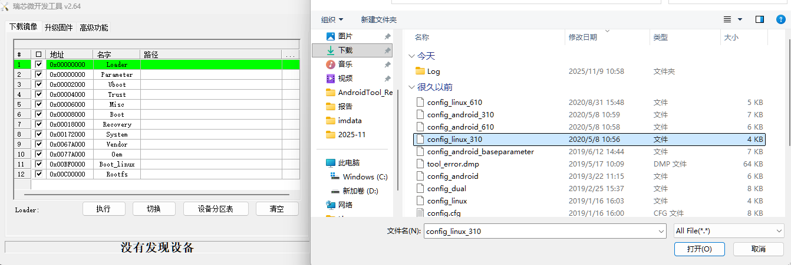

长按 EAIDK-310 开发板上RECOVER键的同时短按RESET键，直到系统进入 Loader

选择制作好的ubuntu的镜像文件，然后点击“执行”按钮，等待烧录完成

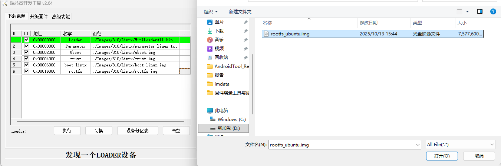

如遇到MiniLoaderALL下载项不存在这样的报错，将之前下载的Image目录中除`rootfs.img`的文件全部复制到烧录工具的`\Images\310\Linux`目录即可解决

烧录完成后，使用HDMI线连接显示器，插上键盘鼠标，插上供电线，等待系统启动，在lightdm登录界面输入用户名和密码，即可进入桌面环境。

## 远程连接开发板

因为开发板的wifi不稳定，时常发生断连，建议使用有线网络连接，将网线插入电脑和开发板之间，需要给有线网卡设置静态的ip地址，使用NetworkManager来设置。

### 命令方式

点击启动器里的终端模拟器，打开终端，输入下面的命令，获取有线网卡的名字。

```shell
nmcli con show
```

找到有线连接的名字，一般是`Wired connection 1`，如果已经本地化，名字会变成`有线连接 1`，输入下面的命令，设置静态ip地址：

```shell
nmcli con mod "有线连接 1" ipv4.method manual ipv4.addresses 192.168.3.100 ipv4.gateway 192.168.3.101
```

因为没装中文输入法，可以直接把上一条命令输出的连接名字复制再粘贴到终端里。

或者使用nmtui来设置，输入命令`nmtui`，进入nmtui界面，选择`Edit a connection`，选择有线连接，按回车，选择`IPv4 CONFIGURATION`，按回车，选择`Manual`，按回车，输入ip地址和网关，按回车，按`OK`，按`Back`，按`Quit`，退出nmtui。

### 图形界面方式

在启动器-系统-高级网络设置，设置有线连接的ip地址。

同时，设置自己电脑的ip地址到相同的网络`192.168.3.xxx`，比如`192.168.3.100`，网关设置为开发板的ip地址`192.168.3.100`。

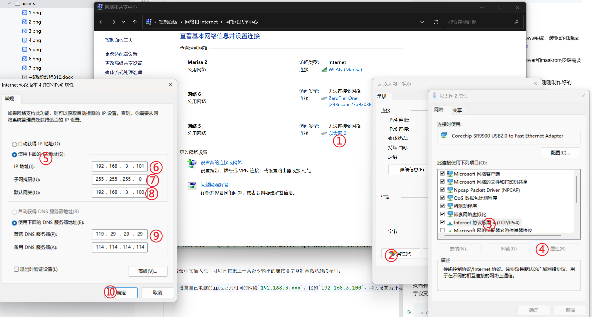

此时，开发板的上网方案有两种，连接可上网的wifi，或者使用有线连接共享电脑的网络，有线方式自行搜索windows共享有线网络的方法。

配置ssh服务，方便远程连接。

生成ssh密钥，重启ssh服务，检查是否正常运行`(active (running))`

```shell
sudo ssh-keygen -A
sudo systemctl restart sshd
sudo systemctl status sshd
```

在电脑上使用ssh连接开发板，打开powershell或终端，输入下面的命令，连接开发板，首次连接时需要输入yes确认，然后再输入密码。

```shell
ssh username@192.168.3.100
```

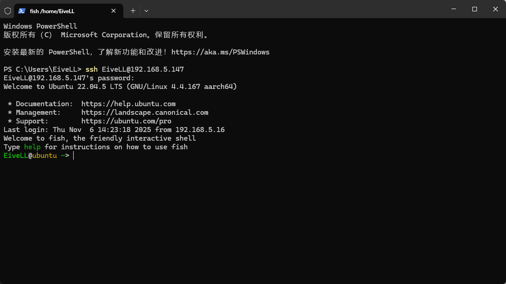

连接成功后，配置远程桌面服务，方便远程桌面连接。可用的方案有xrdp、vnc、nomachine等，这里使用xrdp。

安装xrdp

```shell
sudo apt install -y xrdp
```

在电脑上使用远程桌面连接开发板，输入开发板IP地址，输入用户以及用户密码，即可连接。

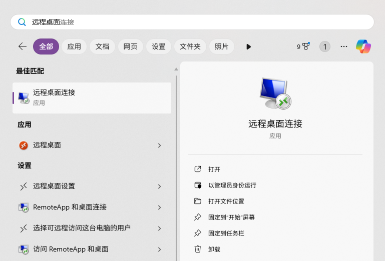

连接上后如图所示

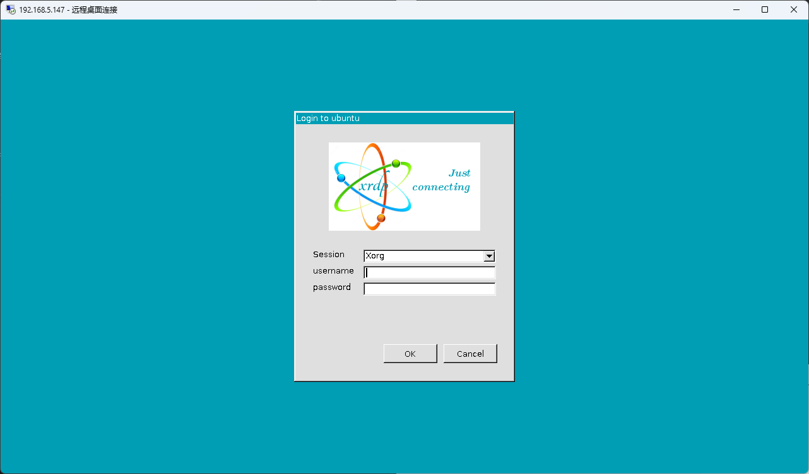

至此，开发板的rootfs配置全部完成。

## 开发环境配置

主要配置Python的开发环境

```shell
sudo apt update
pip3 install opencv-python PyQt5
```

编写一个测试脚本，使用opencv获取摄像头图像，然后交给pyqt去显示，按退出按钮可以关闭程序


```python
import sys
import cv2
import numpy as np
from PyQt5.QtCore import QTimer, Qt
from PyQt5.QtGui import QImage, QPixmap
from PyQt5.QtWidgets import QApplication, QLabel, QVBoxLayout, QPushButton, QWidget

class CameraApp(QWidget):
    def __init__(self):
        super().__init__()
        self.initUI()
        self.cap = cv2.VideoCapture(0)  # 打开摄像头
        if not self.cap.isOpened():
            print("无法打开摄像头")
            sys.exit()

        # 定时器用于刷新摄像头图像
        self.timer = QTimer(self)
        self.timer.timeout.connect(self.update_frame)
        self.timer.start(30)  # 每 30 毫秒刷新一次

    def initUI(self):
        # 设置窗口布局
        self.layout = QVBoxLayout()

        # 用于显示图像的 QLabel
        self.video_label = QLabel(self)
        self.video_label.setAlignment(Qt.AlignCenter)
        self.layout.addWidget(self.video_label)

        # 退出按钮
        self.quit_button = QPushButton("退出", self)
        self.quit_button.clicked.connect(self.close_app)
        self.layout.addWidget(self.quit_button)

        self.setLayout(self.layout)
        self.setWindowTitle("摄像头图像显示")
        self.resize(800, 600)

    def update_frame(self):
        # 从摄像头获取帧
        ret, frame = self.22cap.read()
        if not ret:
            print("无法读取摄像头帧")
            return

        # 转换为 RGB 格式
        frame = cv2.cvtColor(frame, cv2.COLOR_BGR2RGB)

        # 转换为 QImage
        height, width, channel = frame.shape
        bytes_per_line = 3 * width
        q_image = QImage(frame.data, width, height, bytes_per_line, QImage.Format_RGB888)

        # 显示图像
        self.video_label.setPixmap(QPixmap.fromImage(q_image))

    def close_app(self):
        # 释放摄像头并退出程序
        self.cap.release()
        self.timer.stop()
        self.close()

    def closeEvent(self, event):
        # 确保关闭窗口时释放摄像头
        self.cap.release()
        self.timer.stop()
        event.accept()

if __name__ == "__main__":
    app = QApplication(sys.argv)
    camera_app = CameraApp()
    camera_app.show()
    sys.exit(app.exec_())
```

运行效果如下

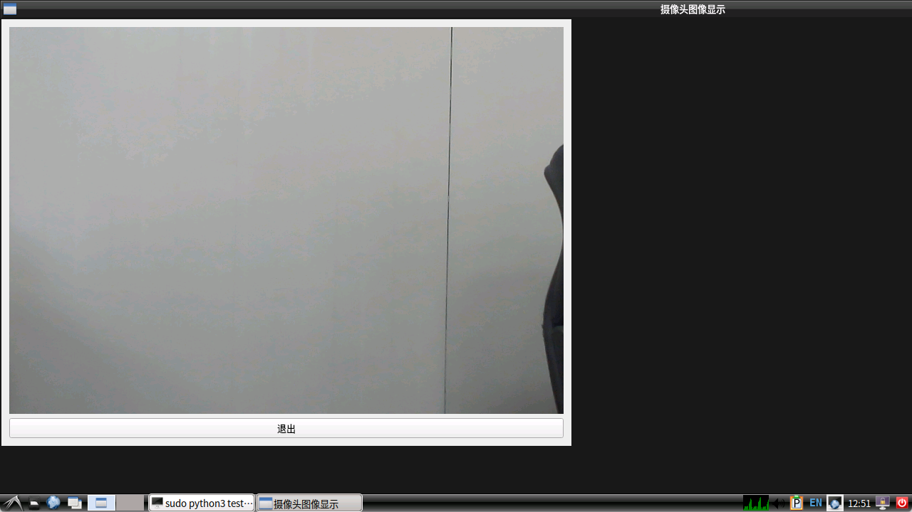

## 任务实现
### 任务描述
设计制作基于单目视觉的目标物测量装置，用于测量并显示基准线到目标物A4纸的距离S、目标物平面（简称物面）上几何图形的边长或直径x，以及目标物的形状T，要求使用口袋实验室EAIDK-310完成以上功能，在终端或图像窗口显示测量值。

具体要求:
    （1）从三个基本目标物中随机取出一个，摆在轴线上的某一指
    定位置。测量并显示D和x以及T。 
    （2）从余下的两个基本目标物中再随机取出一个，摆在轴线上的某一指定
    位置。测量并显示D和x以及T。 
    （3）将最后一个基本目标物摆在轴线上的某一指定位置。
    测量并显示D和x以及T。

说明:任务的目标物为竖立的白色A4纸，其四边印有线宽2cm的黑色边框线，所有目标物面上印制的是黑色实心几何图形。三个基本目标物面（A4纸面）中心位置分别印有圆形、等边三角形、正方形，其直径或边长范围10cm～16cm；目标物测量范围100cm～200cm。

### 任务思路
根据题目要求，本次任务的目标物为竖立的白色A4纸，且四边印有线宽2cm的黑色边框线，具有明显标识，可以据此定位目标物在摄像头的位置，从而进一步测量更多目标物参数。以下为系统流程图:

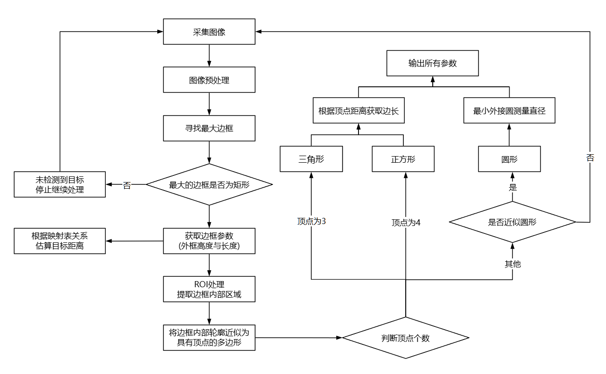

#### 图像预处理
读取的图像为rgb彩色图，为简化计算并突出目标特征，将图像转换为灰度图，消除颜色干扰，便于后续处理。
利用高斯模糊平滑图像，过滤细节噪声。再二值化灰度图，突出目标轮廓。
```shell
gray = cv2.cvtColor(img, cv2.COLOR_BGR2GRAY)
blur = cv2.GaussianBlur(gray, (5, 5), 0)
thresh = cv2.adaptiveThreshold(
    blur, 255, cv2.ADAPTIVE_THRESH_GAUSSIAN_C, 
    cv2.THRESH_BINARY_INV, 11, 2
)
```

#### 获取最大边框与边框参数
二值化处理后A4纸中的边框通常是场景中面积最大、形状规则的矩形区域，利用`cv2.findContours`找到图像中所有外轮廓，计算出像素与厘米变换的比例关系

```shell
contours, _ = cv2.findContours(thresh, cv2.RETR_EXTERNAL, cv2.CHAIN_APPROX_SIMPLE)
contours = sorted(contours, key=cv2.contourArea, reverse=True)
rect = cv2.minAreaRect(a4_outer)
rect_w, rect_h = rect[1]
ppcm = ((rect_w / 21.0) + (rect_h / 29.7)) / 2  # 像素/厘米比例（基于A4纸尺寸）
```

#### 判断最大边框
目标A4纸为矩形区域，通过该步骤确定目标在摄像头的位置
```shell
peri_outer = cv2.arcLength(a4_outer, True)
approx_outer = cv2.approxPolyDP(a4_outer, 0.02 * peri_outer, True)
```

#### ROI处理
利用A4纸的轮廓生成掩膜(mask)，将二值化的图片与掩膜做与运算，只保留轮廓内的区域，后续的形状识别与测量均在该区域中进行
```shell
mask = np.zeros_like(gray)
cv2.drawContours(mask, [a4_outer], -1, 255, -1)
inner_thresh = cv2.bitwise_and(thresh, thresh, mask=mask)
```

#### 轮廓近似处理
计算轮廓周长，将轮廓近似为顶点较少的多边形，之后通过顶点数量确定目标形状
```shell
peri = cv2.arcLength(cnt, True)
approx = cv2.approxPolyDP(cnt, 0.02 * peri, True)
```

#### 通过顶点计算边长
p1与p2为相邻顶点，计算得到两点之间的欧式距离，然后通过比例关系得到实际边长
```shell
for i in range(len(approx)):
    p1 = tuple(approx[i][0])
    p2 = tuple(approx[(i + 1) % len(approx)][0])
    d = np.linalg.norm(np.array(p1) - np.array(p2)) / ppcm
```

至此所有参数都已成功获取，通过终端输出或在窗口图像显示参数即可

效果演示如下

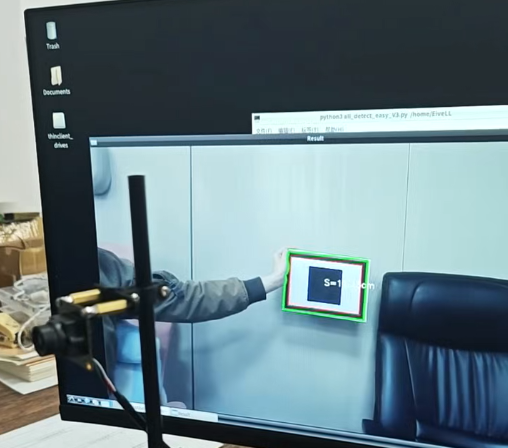

## 附录
EAIDK-310硬件规格

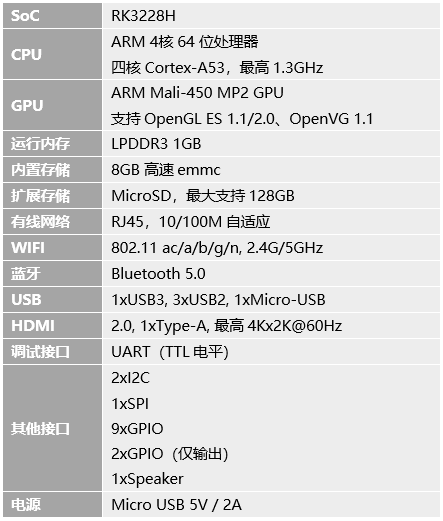